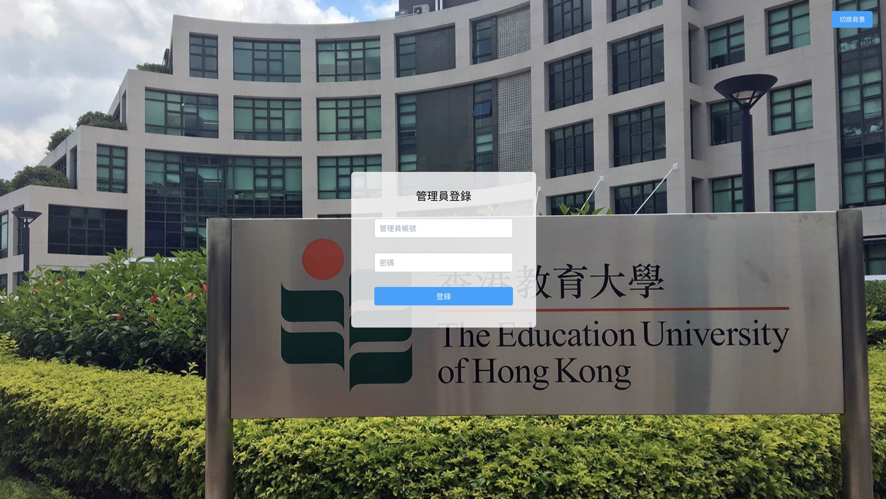
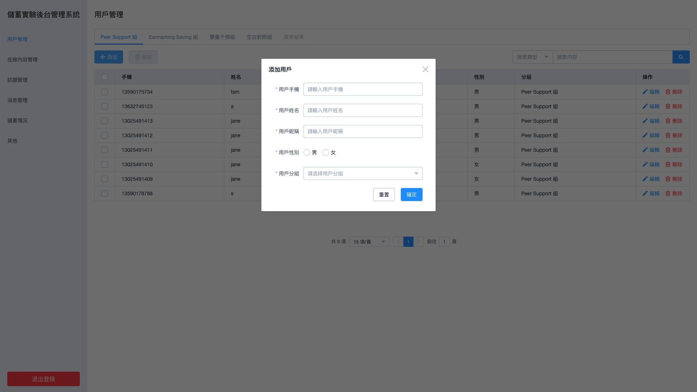
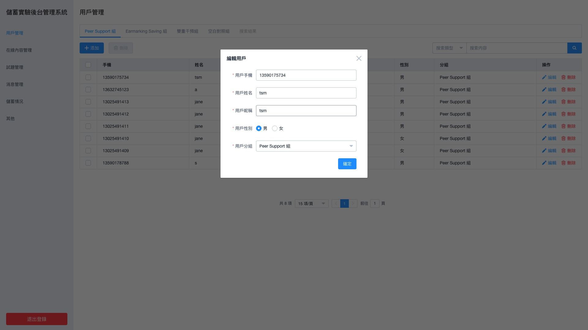
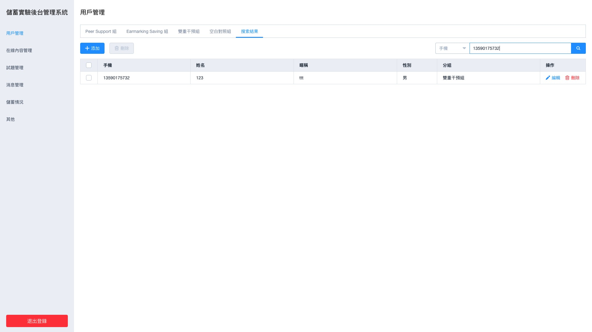
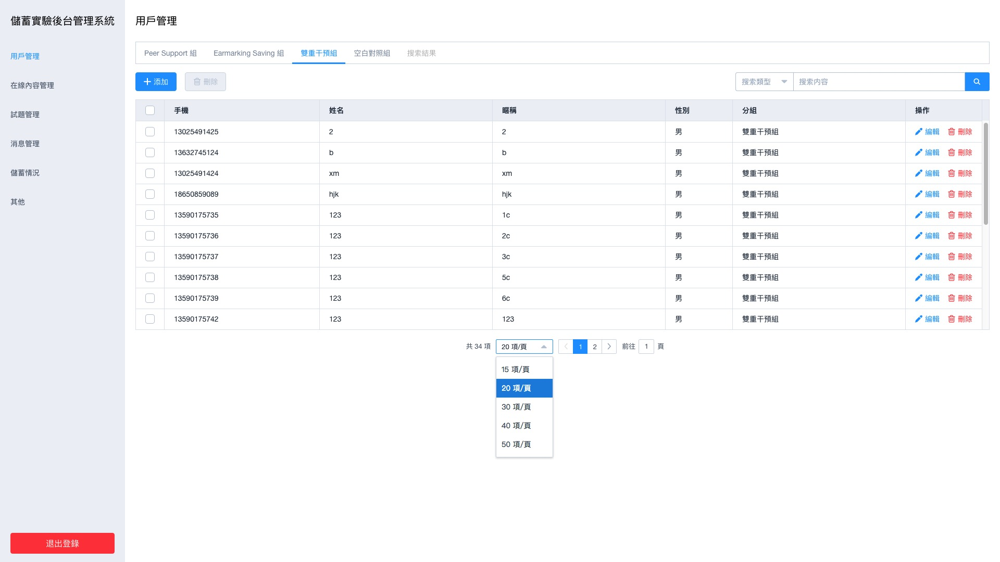

# savings-test-manager

> A manager system for the savings test based on Vue.js.

## Screenshots







## Build Setup

``` bash
# install dependencies
npm install

# serve with hot reload at localhost:8080
npm run dev

# build for production with minification
npm run build

# build for production and view the bundle analyzer report
npm run build --report
```

## License

GNU General Public License v3.0
